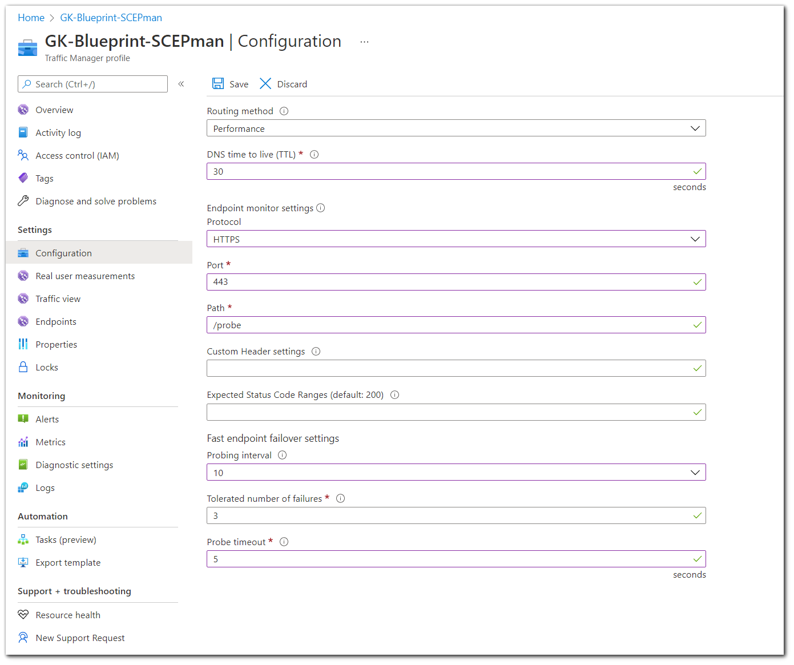

# Geo-redundancy


SCEPman Enterprise Edition only


## Geo-redundant Deployment (optional)

This section describes a high availability architecture for production use.

 (7) (7) (1) (1) (1) (1) (1) (1) (2) (6).png>)

## Clone App

After a successful deployment of SCEPman, Set up a custom domain for this SCEPman instance as described [here](custom-domain.md).

Now you can set up a load balancer for higher availability. Start cloning the app:

* Navigate to SCEPman **App Service.**&#x20;
* Scroll down to **Development Tools** and click on **Clone App.**&#x20;
* Fill in the required fields as follows:

* **Resource Group:** create a new Resource Group for the cloned instance of SCEPman
* **Name:** choose a unique name for the new app service
* **Region:** choose a secondary location for the new cloned App Service, this will automatically create a new App Service Plan in this region.

Next, after the deployment succeeds, you need to do 3 more steps:

Delete the <code>ManagedIdentityEnabledOnUnixTime</code> setting

Navigate in your cloned app service to **Configuration** and delete the setting `AppConfig:AuthConfig:ManagedIdentityEnabledOnUnixTime` then save settings (see screenshot)

Enable Identity option

Navigate to **Identity** turn it on and save

Setup Azure Key Vault Access Policy

* Navigate to your **Key Vault** (in the primary resource group) and go to **Access policies** and add access policy for your new cloned app service (see screenshot below)
* For **Key, Secret and Certificate permissions** add all permissions except the **Privileged Certificate Operations "Purge"** leave it unchecked (see screenshot)
* By **Select principal** choose your cloned app service
* Add and save

After you set all settings above, you need to restart your cloned app service and go to the last step, running the PowerShell script (same procedure you already did by the primary SCEPman) [Installation and run the PowerShell Module](../post-installation-config.md#acquire-and-run-the-scepman-installation-powershell-module)


Cloning an app service has some restrictions such as **autoscale** settings, **backup schedule** settings, **app Insights, logging**, etc.. so you have to configure them again (if needed) for the new cloned app service. For more info visit [https://docs.microsoft.com/en-us/azure/app-service/app-service-web-app-cloning#current-restrictions](https://docs.microsoft.com/en-us/azure/app-service/app-service-web-app-cloning#current-restrictions)


## Setup Traffic Manager

1. Search **Traffic Manager profile** and click **Create.**&#x20;
2. Fill in the fields.

 (2) (2) (2) (2) (2) (2) (2) (2) (2) (2) (2) (2) (2) (2) (6) (7) (5) (1) (1) (1) (1) (1) (1) (2) (6).png>)

1. Then click **Create**.
2. After your Traffic Manager is deployed, go to it and click **Configuration** under settings.
3. Change the settings as follows:

1. Save changes.
2. Then under **Settings** choose **Endpoints**
3. Click **Add** and choose the primary web service.

Repeat these steps for your second web service.

In the **Overview** your Traffic Manager should like this (here you find the Traffic Manager URL):

 (1) (1) (1) (1) (1) (2) (6).png>)

* Navigate to your **AppService** for the cloned SCEPman instance
* Under **Custom Domains**, repeat the SSL certificate binding process as described [here](https://docs.scepman.com/scepman-configuration/optional/custom-domain#SSL-Binding)
* Both instances of SCEPman must have the same custom domain
* Navigate to your DNS management service (e.g. **Azure DNS Zones**)
* There shall be a CNAME entry for the custom SCEPman domain that maps to the Traffic Manager endpoint. This entry may exist already if you are using Azure DNS and Traffic Manager created the entry for you. If it does not exist, remove any possibly existing wrong CNAME entry and add a CNAME that maps the custom SCEPman domain to the Traffic Manager endpoint now.


In **Azure DNS Zone**, in order to modify a record, you first have to remove the DNS lock by navigating to **Locks**.

